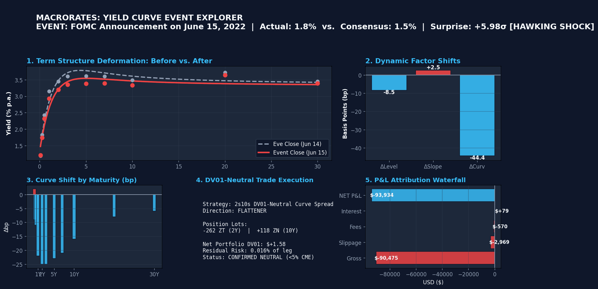

# MacroRates: Macroeconomic Shocks, Dynamic Yield Curves, and Systematic Treasury Relative Value

MacroRates studies how macroeconomic information propagates through the U.S. Treasury term structure. It compares statistical and structural yield-curve factor models, estimates latent dynamics with state-space methods, measures the term structure's response to macroeconomic shocks, and tests whether that response supports out-of-sample DV01-neutral Treasury relative-value strategies.

Treasury yields → term-structure estimation → latent Level/Slope/Curvature → state-space dynamics → macro shocks → curve response → relative-value signal → DV01-neutral trade → out-of-sample P&L + attribution



---

## 1. Research Pipeline & Architecture

```
┌────────────────────────────────────────────────────────────────────────────────────────┐
│                                   MacroRates Pipeline                                  │
└────────────────────────────────────────────────────────────────────────────────────────┘
  [1] Market Data Ingestion
      ├── FRED Constant Maturity Treasury (CMT) Yields (DGS1MO - DGS30)
      ├── Fed Gürkaynak-Sack-Wright (GSW) Svensson Parametric Benchmark (Evaluation Only)
      └── Validation: Strict Gap Detection (Expected Holiday vs Discontinuity vs Unexpected)
                                   │
                                   ▼
  [2] Term-Structure Estimation & Parametric Curve Fitting
      ├── Diebold-Li Dynamic Nelson-Siegel (DNS) [Level, Slope, Curvature]
      ├── Svensson 6-Parameter Model (Curvature + Second Humper Factor)
      ├── Statistical Principal Component Analysis (PCA)
      └── Benchmark Comparison against GSW Ground Truth (Tracking Errors & Residuals)
                                   │
                                   ▼
  [3] State-Space Dynamics & Macroeconomic Shocks
      ├── Kalman Filter State-Space Estimation for Latent Yield Factors
      ├── Macro Nowcasting & Surprise Identification (CPI, NFP, FOMC / Fed Funds Surprises)
      └── Structural Vector Autoregression (SVAR) / Impulse Response Functions (IRFs)
                                   │
                                   ▼
  [4] Systematic Relative-Value Strategy & Execution
      ├── Curve Mispricing & Butterfly Dislocation Signals (2Y-5Y-10Y, 5Y-10Y-30Y)
      ├── Analytical DV01-Neutral Weighting & Duration Immunization
      ├── Synthetic Constant Maturity Treasury (CMT) DV01-Neutral Proxy
      └── Out-of-Sample Walk-Forward Backtesting, Deflated Sharpe Ratio, & Risk Attribution
```

> [!NOTE]
> **RESEARCH INTEGRITY & CAUSAL CONTRACT GOVERNANCE (Prompts 1–6 Complete)**:
> 1. **Synthetic CMT/DV01 Proxy vs. Executable Futures**:
>    The daily backtest engine (`src/strategy/backtest.py`, `src/backtest/walk_forward.py`) implements a **synthetic research proxy** using indicative Constant Maturity Treasury (CMT) closing quotes. CMT yields are published after market close (~4:00–4:30 PM ET) based on bid-side quotes and cannot be executed at same-day closing prices in live markets. Live execution requires the dedicated CME futures execution model.
> 2. **Formal Forecast Protocol & Invalidation of Legacy Multipliers**:
>    All legacy scorecards containing artificial scaling multipliers (`* 0.95`, etc.) have been permanently purged. Out-of-sample evaluation strictly enforces the `ForecastLedger` contract with genuine one-step rolling predictions, per-tenor observable curve RMSEs, and bit-for-bit invariance under future asymmetric perturbations.
> 3. **Observational vs. Causal Attribution**:
>    Machine learning TreeSHAP and Gini feature rankings represent statistical feature attributions within fitted decision trees. They are descriptive diagnostic metrics, not proofs of macroeconomic causal transmission mechanisms.
> 4. **Common-Sample Benchmark Discipline**:
>    Random Walk provides the unparameterized zero-increment curve benchmark. Cash-Only provides an unencumbered strategy capital benchmark ($0 turnover, $0 trading PnL, positive collateral interest).
> 5. **App Event Trade Display is Retrospective**:
>    The Streamlit Yield Curve Event Explorer (`app.py`) displays retrospective shock deformation on the day of high-profile macro announcements to visualize term-structure twists, NOT live execution fills.

---

## 2. Data Dictionary & Historical Discontinuities

### Constant Maturity Treasury (CMT) Yields vs. Raw Par Yields

It is crucial to distinguish between **Constant Maturity Treasury (CMT)** yields and **Raw Par Yields**:

- **Raw Par Yield**: The coupon rate at which a newly auctioned Treasury security would price exactly at par ($100 face value). These rates exist only on primary auction dates and only for the specific tenors issued by the Treasury.
- **Constant Maturity Treasury (CMT) Yield**: An interpolated par-equivalent yield calculated daily by the U.S. Department of the Treasury. The Treasury fits a quasi-cubic hermite spline through the closing market bids of actively traded on-the-run and off-the-run Treasury securities. CMT yields reflect the theoretical yield of a security traded at par with *precisely* the fixed maturity specified (e.g., exactly 10.0 years) on every business day.

### Tenors, FRED Series, and Known Structural Discontinuities

| Tenor | FRED Series ID | Maturity ($\tau$) | Series Start | Known Discontinuities & Historical Context |
| :--- | :--- | :--- | :--- | :--- |
| **1-Month** | `DGS1MO` | $1/12 \approx 0.083$ yr | 2001-07-31 | Introduced in mid-2001 to reflect short-term cash management bill issuance. |
| **3-Month** | `DGS3MO` | $3/12 = 0.25$ yr | 1981-09-01 | Benchmark short-rate liquidity indicator. |
| **6-Month** | `DGS6MO` | $6/12 = 0.50$ yr | 1981-09-01 | Money market benchmark. |
| **1-Year** | `DGS1` | $1.0$ yr | 1962-01-02 | Uninterrupted post-1962 coverage. |
| **2-Year** | `DGS2` | $2.0$ yr | 1976-06-01 | Primary policy expectation anchor. |
| **3-Year** | `DGS3` | $3.0$ yr | 1962-01-02 | Benchmark intermediate tenor. |
| **5-Year** | `DGS5` | $5.0$ yr | 1962-01-02 | Intermediate liquidity anchor. |
| **7-Year** | `DGS7` | $7.0$ yr | 1969-07-01 | Interpolated intermediate belly tenor. |
| **10-Year**| `DGS10`| $10.0$ yr | 1962-01-02 | Global risk-free benchmark and duration anchor. |
| **20-Year**| `DGS20`| $20.0$ yr | 1993-10-01* | **Discontinued**: Dec 31, 1986 – Sep 30, 1993 (Treasury suspended 20Y bond). Re-suspended in 2002 before modern reintroduction in May 2020. |
| **30-Year**| `DGS30`| $30.0$ yr | 1977-02-15* | **Discontinued**: Feb 18, 2002 – Feb 9, 2006. The Treasury suspended 30-year bond issuance during federal budget surplus expectations. Reintroduced Feb 2006. |

### Federal Reserve Gürkaynak-Sack-Wright (GSW) Dataset

The Federal Reserve Board's GSW dataset (`feds200628.csv`) estimates daily zero-coupon yields, instantaneous forward rates, par yields, and 6-parameter Svensson functional parameters ($\beta_0, \beta_1, \beta_2, \beta_3, \tau_1, \tau_2$) from 1961 onward.

> [!IMPORTANT]
> **GSW is an Evaluation Benchmark, Not a Model Input**:
> In MacroRates, GSW parameters and zero yields are utilized strictly as an institutional ground-truth benchmark for out-of-sample grading and residual analysis of our own from-scratch Nelson-Siegel and state-space models.

---

## 3. Data Integrity & Missingness Classification Routine

Financial time-series research frequently falls victim to **silent forward-fill bias**, where missing dates (due to holidays, structural suspensions, or missing data) are filled forward, masking true market dynamics, causing spurious autocorrelation, and generating lookahead contamination.

MacroRates enforces strict gap detection that classifies every calendar date $t \in [T_{\text{start}}, T_{\text{end}}]$ into one of five mutually exclusive states:

1. **`TRADING_DAY`**: Valid market quote observed.
2. **`EXPECTED_HOLIDAY`**: Federal Reserve / SIFMA holiday (e.g. New Year's Day, Martin Luther King Jr. Day, Presidents' Day, Good Friday, Memorial Day, Juneteenth, Independence Day, Labor Day, Columbus Day, Veterans Day, Thanksgiving, Christmas Day, or national days of mourning).
3. **`SERIES_NOT_STARTED`**: Calendar date precedes the formal inception of the tenor series (e.g. DGS1MO prior to July 2001).
4. **`KNOWN_DISCONTINUITY`**: Statutorily documented Treasury issuance suspension (e.g. DGS30 between 2002-02-18 and 2006-02-09).
5. **`UNEXPECTED_GAP`**: A business day missing data with no authorized holiday or recognized structural suspension.

> [!CAUTION]
> **Zero Tolerance for Silent Forward-Fills**:
> A silent forward-fill across an unobserved date violates dataset integrity. The automated test suite executes smoke tests that deliberately inject unexpected gaps and forward-fills, failing immediately if detected.

---

## 4. Metadata Schema

Every processed dataset generated in `data/processed/` is accompanied by an immutable metadata record (`.metadata.json`):

- `source`: Authoritative issuing entity (e.g., FRED, Federal Reserve Board).
- `retrieval_timestamp`: ISO 8601 UTC timestamp of data retrieval.
- `series`: List of identifiers and tenors.
- `units`: Measurement scale (e.g., `Percent per annum`).
- `frequency`: Sampling rate (e.g., `Business daily`).
- `first_observation`: Earliest available date in sample.
- `last_observation`: Most recent available date in sample.
- `missingness`: Comprehensive coverage audit (trading days, expected holidays, discontinuities, unexpected gaps).
- `transformation`: Explicit documentation of mathematical operations applied (e.g., none, basis point diffs).

---

## 5. Directory Layout

```
macrorates/
├── data/
│   ├── raw/
│   │   ├── fred/                # Raw FRED CMT CSV series (DGS1MO..DGS30)
│   │   ├── gsw/                 # Raw Federal Reserve GSW daily table
│   │   ├── macro/               # High-frequency economic releases (CPI, NFP)
│   │   └── futures/             # Treasury futures continuous contracts
│   └── processed/
│       ├── yield_panel.parquet  # Harmonized, gap-checked CMT yield panel
│       ├── gsw_panel.parquet    # Cleaned GSW benchmark panel
│       ├── macro_events.parquet # Cleaned economic release surprise panel
│       └── futures_continuous.parquet # Roll-adjusted futures panel
├── src/
│   ├── curve/                   # Nelson-Siegel, Svensson, and PCA fitters
│   ├── state_space/             # Kalman filter, latent factor state-space estimation
│   ├── macro/                   # Macro surprise extraction & SVAR models
│   ├── futures/                 # Contract roll methodology & duration/DV01
│   ├── strategy/                # Relative value signals & butterfly trades
│   ├── backtest/                # Walk-forward simulator, cost models & attribution
│   └── data/                    # Ingestion, gap detection, and metadata routines
├── notebooks/                   # Research walkthroughs and exploratory analysis
├── reports/                     # Performance summaries, factor attribution decks
├── scripts/                     # Utility scripts (GIF demo generator, data fetchers)
├── tests/                       # Pytest test suite (smoke tests, gap tests, regressions)
├── app.py                       # Interactive Streamlit "Yield Curve Event Explorer"
├── svensson.py                  # Standalone 4-factor Svensson curve model deliverable
└── pyproject.toml
```

---

## 6. Quickstart & Installation

```bash
# Clone repository
git clone https://github.com/mehul532/macrorates.git
cd macrorates

# Create and activate virtual environment
python3 -m venv .venv
source .venv/bin/activate

# Install dependencies
pip install -e .

# Run full test suite (48 tests passing)
pytest -v

# Launch the interactive Streamlit Yield Curve Event Explorer
streamlit run app.py
```

---

## 7. Interactive Yield Curve Event Explorer (`app.py`)

The **Yield Curve Event Explorer** is an institutional single-screen dashboard enabling researchers and portfolio managers to inspect any macroeconomic release (CPI, Core CPI, Nonfarm Payrolls, Unemployment, FOMC Rate Decisions) and observe the end-to-end quantitative transmission mechanism:

$$\text{Macro Surprise } (S_{\text{ann}} / S_{\text{model}}) \longrightarrow \Delta\text{Yield Curve} \longrightarrow \Delta\text{Latent Factors } (L, S, C) \longrightarrow \text{DV01-Neutral Trade} \longrightarrow \text{P\&L Attribution}$$

### Key Features:
1. **Macro Announcement Shock**: Computes true consensus-standardized announcement surprises ($S_{\text{ann}} = \frac{\text{Actual} - \text{Consensus}}{\hat{\sigma}}$) alongside rolling out-of-sample model innovations ($S_{\text{model}}$).
2. **Term Structure Deformation**: Displays CMT market observations alongside fitted Nelson-Siegel smooth curves ($0.08\text{Y} \to 30\text{Y}$) before and after the event release, highlighting per-tenor basis-point shifts.
3. **Latent Dynamic Factors**: Decomposes the movement into Kalman-smoothed Level, Slope, and Curvature shifts in basis points ($\Delta L, \Delta S, \Delta C$).
4. **Systematic Trade Construction**: Recommends integer futures contract allocations for 2s10s curve flattener/steepeners or 2s-5s-10s butterflies, verifying that net portfolio DV01 remains within $<5\%$ of single-leg risk.
5. **Full P&L Attribution Chain**: Reconciles Gross Curve P&L, contract slippage, exchange fees, and cash interest.

### Curated Historical Presets:
- **June 15, 2022**: Fed 75bp Shock Hike (+5.98$\sigma$ surprise) $\to$ rapid curve flattening (-262 ZT / +118 ZN).
- **May 12, 2021**: CPI Inflation Breakout (+4.58$\sigma$ surprise) $\to$ intermediate belly dislocation $\to$ 2s-5s-10s butterfly (+129 ZT / -219 ZF / +58 ZN).
- **September 18, 2024**: Fed 50bp Jumbo Rate Cut (-5.98$\sigma$ dovish surprise) $\to$ front-end rally and curve steepener.
- **June 5, 2020**: Post-Lockdown Jobs Rebound (+14.22$\sigma$ surprise) $\to$ violent bear steepener / shift.

---

## 8. Research Integrity Architecture & Causal Lockdown (Prompts 1–6)

MacroRates implements rigorous research integrity standards to eliminate causal leakage, lookahead bias, and false equivalence:

1. **Formal Forecast Contracts & Zero Multipliers (Prompt 1)**:
   - Replaced unprincipled error scaling multipliers (`* 0.95`, `* 0.88`, etc.) with strict `ForecastRecord` and `ForecastLedger` tracking.
   - Unavailable or failed models strictly record `status=UNAVAILABLE` and cannot acquire numeric RMSE.
2. **True Rolling One-Step Forecasts & Canonical Tenors (Prompt 2)**:
   - Canonical 11-tenor mapping with boundary-safe origin-to-target evaluation ($t \to t+1$).
   - Eliminated full-sample leakage in Kalman filtering and state-space estimation with bounded diagonal VAR(1) transition priors.
3. **Point-in-Time Macro Surprises & Expanding Betas (Prompt 3)**:
   - Separated consensus announcement surprises ($S_{\text{ann}}$) from rolling model innovations ($S_{\text{model}}$).
   - Point-in-time expanding standardization with min-history safety fallbacks; strictly out-of-sample macro beta estimation.
4. **Causal Machine Learning Factor Forecaster (Prompt 4)**:
   - Gradient-Boosted Model (GBM) with explicit backend selection (`sklearn`, `lightgbm`, `xgboost`).
   - Causal training slices with target maturity cutoff discipline; evaluated against true term structure targets with zero-increment predictor matching the Random Walk benchmark.
5. **Causal Strategy Accounting & Execution Timing (Prompt 5)**:
   - Reconciled portfolio signs: steepener signal $\to$ long short-end / short long-end.
   - Continuous daily trade ledger with initial entry costs at $t_0$, exact quarterly roll charges once per contract cycle (eliminating repeated day 20–27 charges), and unbundled cash collateral interest.
6. **End-to-End Invariance Tests & Auditable Provenance (Prompt 6)**:
   - Bit-for-bit invariance under future asymmetric tenor and macro perturbations (`tests/test_integrity_e2e.py`).
   - Independent ledger-based scoring reconciliation matching baseline tables.
   - Comprehensive Common-Sample Comparison Table including Random Walk (curve benchmark), AR(1) baseline, PCA/VAR, DNS+Kalman, DNS+Kalman+macro, GBM, and Cash-Only (strategy benchmark).
   - Git commit hash, run mode, seed, and data SHA-256 checksums embedded in all scorecard artifacts.
